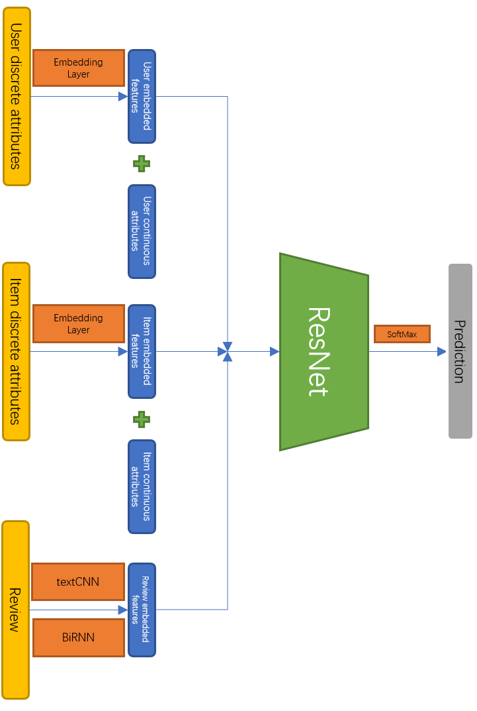

  

# SiZeLet
The implementation of SiZeLet (SZL) proposed in the paper [*Everything Can Be Embedded*](https://github.com/ZhiliShen/SiZeLet/blob/main/paper/Everything%20Can%20Be%20Embedded.pdf) by Zhili Shen.

## Prerequisites
1. Download the **Product Fit** dataset from this [link](https://cs.nju.edu.cn/liyf/aml21/product_fit.zip), and unzip it in the project folder.
2. Download the **GloVE Word Embdding** from this [link](https://apache-mxnet.s3.cn-north-1.amazonaws.com.cn/gluon/embeddings/glove/glove.twitter.27B.zip), move it to the *`./cache`* folder after unzipping *glove.twitter.27B.zip*.

## Model Architecture of SiZeLet
<br>

<br>

## Usage
1. You can configure SiZeLet in *`config.py`*, SiZeLet has these options:
* **train_test_proportion**: proportion of training set and validation set.
* **TextCNNorBiRNN**: use textCNN or BiRNN.
* **max_length_sentence**: the length of the longest sentence.
* **min_frequency**: words with word frequency lower than this number will be deleted.
* **use_pretrained_model**: whether to use a pre-trained model.
* **user_embedding_dim**: user discrete attribute embedding dimension.
* **item_embedding_dim**: item discrete attribute embedding dimension.
* **review_embedding_dim**: review discrete attribute embedding dimension.
* **kernel_sizes**: textCNN convolution kernel size.
* **num_channels**: textCNN channel size.
* **num_hidden**: BiRNN hidden layer dimension.
* **num_layers**: BiRNN hidden layer number.
* **lr**: learing rate.
2. Run *`train.py`* file 
```
python train.py
```
3. The result will appear in *`./output/output.txt`* 

## Performance on Validation Set
F1-score | Accuracy |  AUC  |
|:--------:|:--------:|:-----:|
| 0.713    | 0.831   |   0.886  |
